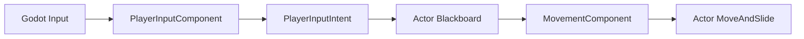
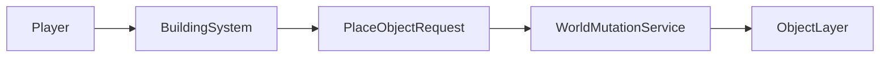

# Multiplayer-Ready Architecture

This document describes the multiplayer-prep architecture. It does not describe a finished network implementation. The current target is still single-player behavior with explicit ownership boundaries that can later support a Terraria-like local host.

## Goals

- Keep the existing `Actor`, component, blackboard, and state machine gameplay model.
- Stop treating the player as a global singleton.
- Route local input through a player-owned intent boundary.
- Bind UI and camera behavior to a local player context.
- Send world changes through a single mutation boundary that can later become host-authoritative.

## Core Concepts

### Player Identity

Each `Player` has:

- `PlayerId`: stable local id. The default single-player id is `1`.
- `IsLocalPlayer`: whether this process should drive input and presentation for this player.
- `InputDeviceId`: reserved for later keyboard/gamepad/peer routing.

These fields are local architecture metadata only. They are not network peer ids yet.

### Player Registry

`PlayerRegistry` tracks valid players by `PlayerId`. Game systems should ask the registry for player candidates instead of scanning the scene and assuming the first node in the `Player` group is the player.

Current owner:

- `GameManager.PlayerRegistry`

Current users:

- `GameManager` for respawn and local player setup.
- `Enemy` for target selection.

### Local Player Context

`LocalPlayerContext` answers: "which player should this process present as local?"

Current owner:

- `GameManager.LocalPlayerContext`

Current users:

- `GameInventoryUI` binds to `LocalPlayerContext.CurrentPlayer`.
- `GameManager` updates the Phantom Camera follow target only for the local player.

Future client builds can bind a different local player without changing simulation entities.

## Input Flow

`PlayerInputIntent` is the boundary between platform input and game simulation. It currently contains movement direction only. Future work can add attack, selected hotbar slot, aim position, build request, and interact request.

`Player._UnhandledInput` still handles attack and hotbar actions directly, but now only for `IsLocalPlayer`. This keeps current gameplay working while making remote/non-local players passive from this process.

## World Mutation Flow

`WorldMutationService` is local and immediate today. Its purpose is to create a replaceable boundary for future host authority:

- validate the requesting player
- validate the requested object and position
- assign stable world entity ids
- replicate accepted changes to clients
- persist accepted changes to world save data

## Future LAN Host Route

1. Add a session layer that maps `PlayerId` to peer/device ownership.
2. Expand `PlayerInputIntent` into a serializable command object.
3. Move attack, building, item pickup, and inventory changes behind command or mutation services.
4. Make the host execute accepted commands and publish snapshots or events.
5. Add stable ids for spawned objects, drops, enemies, and placed buildings.
6. Add world/player save files using the same stable ids and item ids.

## Current Non-Goals

- No `MultiplayerAPI`, RPC, or synchronizer integration.
- No client prediction or rollback.
- No anti-cheat validation.
- No persistent Terraria-style world save yet.
- No split-screen or multiple local input devices yet.
